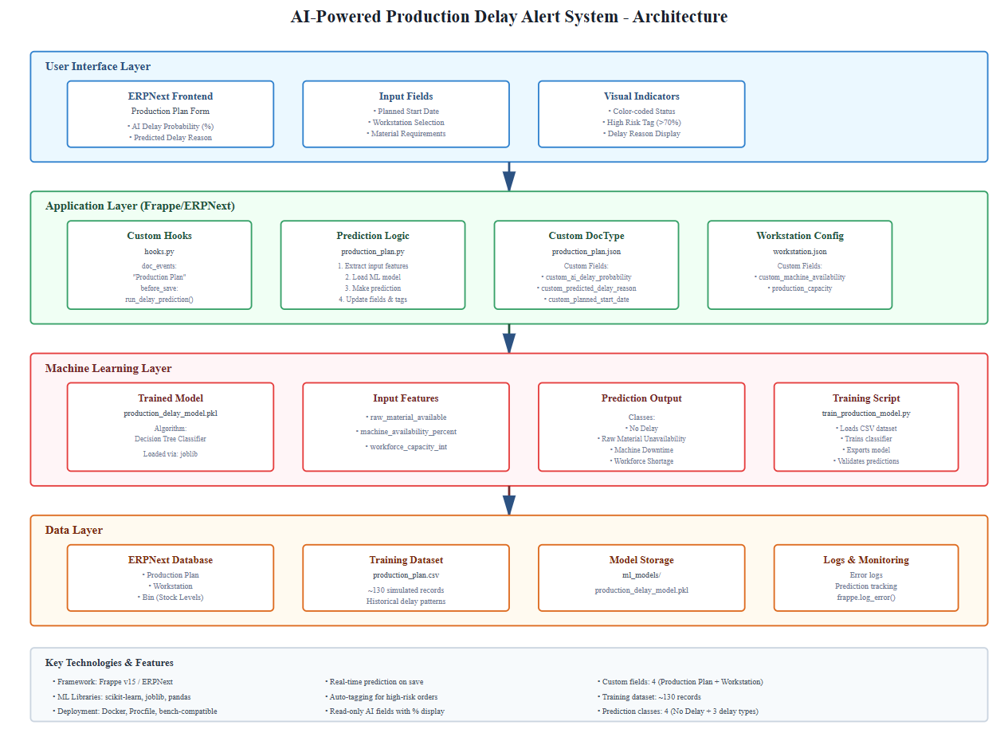

# Predictive Production Delay Alert System

---

## Assignment Title
**“Predictive Production Delay Alert System”**

---

## Background

> One of **ALFASTACK**'s manufacturing clients frequently faces delays in their production orders due to **raw material unavailability**, **machine downtime**, and **workforce shortage**.
>
> They want a **smart system** that can **predict the likelihood of delay** in a new production order and **flag it early in ERPNext**.

---

## Assignment Objectives

### 1. Frappe App Customization (Manufacturing Module)

- Extend the **Production Order** doctype with:
  - **AI Delay Probability (%)**
  - **Predicted Delay Reason** (select or free-text)

---

### 2. Simulated Dataset + ML Model

- Simulate a dataset (**100–200 records**) of production orders with fields like:
  - Planned start date
  - Availability of raw materials
  - Assigned workstations
  - Machine availability %
  - Shift capacity, etc.

- Train a basic classifier (e.g., **logistic regression** or **decision tree**) to predict **probability of delay**

- Include **rule-based logic** or **NLP-generated insights** if helpful

---

### 3. Workflow Integration

- Create a **custom action** or **scheduled job** that, when triggered:
  - Predicts delay risk
  - Updates the new fields

- Automatically flag **“high risk”** orders via:
  - ERP status **color-coding**
  - Or a **tag**

---

### 4. Deployment Simulation

- Include:
  - `Procfile`
  - `Dockerfile`
  - `requirements.txt`
  - Bench compatibility

---

### 5. Presentation & Docs

- **README** with:
  - Architecture flow
  - Model logic
  - Use-case explanation

- **Short screen recording (~5–10 min)** showing:
  - Prediction in action on ERPNext frontend

---

## Skills Tested

| Skill | Status |
|------|--------|
| ML understanding (classification problem) | Completed |
| Real-world manufacturing logic awareness | Completed |
| ERPNext backend customization | Completed |
| DevOps & deployment readiness | Completed |
| Communication & documentation clarity | Completed |

---

## Architecture Flow

## Demo Video
[Watch the demo](./ml_production/public/assests/demoVideo.mp4)
